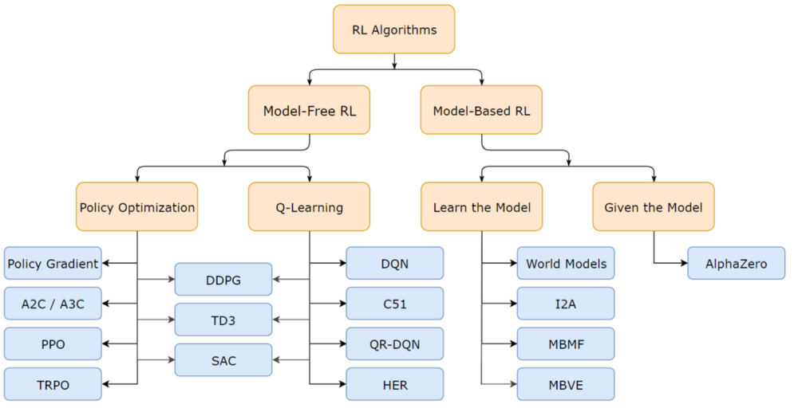
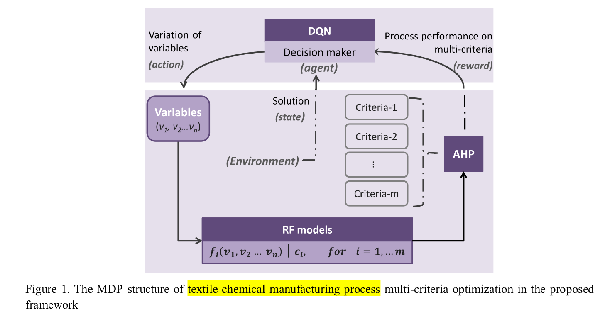
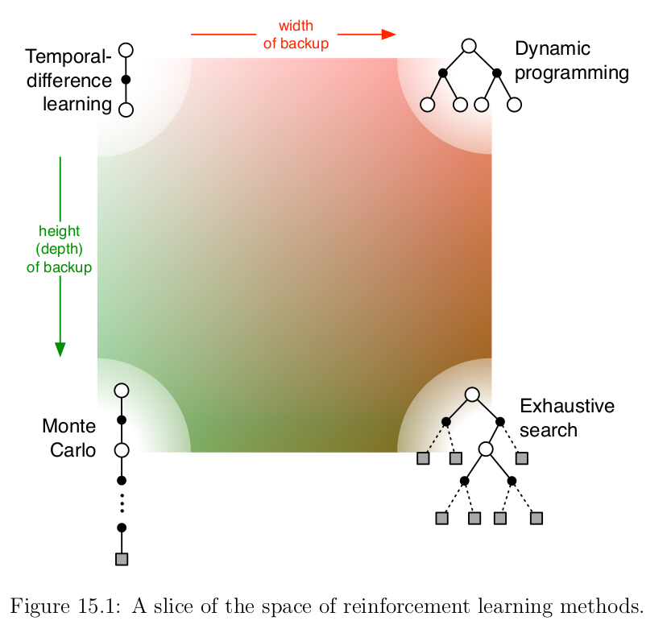

---
aliases:
- /reinforcement learning/2021/01/26/reinforcement-learning-readings
categories:
- reinforcement learning
date: '2021-01-26'
description: My notes about some readings
image: images/RL.png
layout: post
title: Reinforcement learning readings
toc: true

---

## 1/26/21 - Reinforcement learning for real-world robotics

from [https://www.youtube.com/watch?v=Obek04C8L5E&feature=youtu.be](https://www.youtube.com/watch?v=Obek04C8L5E&feature=youtu.be)

at 26' idea that you can tackle over-optimism models by using ensemble models.
See paper at [2018 Model-Ensemble Trust-Region Policy Optimization](https://github.com/castorfou/datascience-papers/blob/main/RL/2018%20Model-Ensemble%20Trust-Region%20Policy%20Optimization/model_ensemble_trust_region_policy_optimization.pdf)

## 1/26/21 - Reinforcement Learning algorithms — an intuitive overview

from [https://medium.com/@SmartLabAI/reinforcement-learning-algorithms-an-intuitive-overview-904e2dff5bbc](https://medium.com/@SmartLabAI/reinforcement-learning-algorithms-an-intuitive-overview-904e2dff5bbc)

give an overview of various RL models. Model-based vs model-free.

And papers and codes.

## 1/26/21 - Reinforcement learning, partie 1 : introduction (in French)

There is a reference to an introduction paper:
from Sutton, Richard S., and Andrew G. Barto [« Reinforcement learning : an introduction. » (2011)](https://github.com/castorfou/datascience-papers/blob/main/RL/2015%20Reinforcement%20Learning%20an%20introduction%20-%20Sutton%2C%20Richard%20S.%2C%20and%20Andrew%20G.%20Barto/SuttonBartoIPRLBook2ndEd.pdf). (I have an updated version from 2015)

There is a reference to a blog article [[2] Steeve Huang. “Introduction to Various Reinforcement Learning Algorithms. Part I” (Q-Learning, SARSA, DQN, DDPG)”. (2018)](https://towardsdatascience.com/introduction-to-various-reinforcement-learning-algorithms-i-q-learning-sarsa-dqn-ddpg-72a5e0cb6287)

And the paper for OpenAI Gym [[3] Greg Brockman, Vicki Cheung, Ludwig Pettersson, Jonas Schneider, John Schulman, Jie Tang, Wojciech Zaremba. “OpenAI Gym”. (2016)](https://github.com/castorfou/datascience-papers/blob/main/RL/2016%20OpenAI%20Gym/1606.01540.pdf)

## 1/27/21 - Reinforcement learning : an introduction - I tabular solution methods

as a ref. from Reinforcement learning, partie 1 : introduction (in French)

I like this summary about RL

> Reinforcement learning is a computational approach to understanding and automating goal-directed learning and decision-making. It is distinguished from other computational approaches by its emphasis on learning by an agent from direct interaction with its environment, without relying on exemplary supervision or complete models of the environment. In our opinion, reinforcement learning is the first field to seriously address the computational issues that arise when learning from interaction with an environment in order to achieve long-term goals.
> Reinforcement learning uses a formal framework defining the interaction between a learning agent and its environment in terms of states, actions, and rewards. This framework is intended to be a simple way of representing essential features of the artificial intelligence problem. These features include a sense of cause and effect, a sense of uncertainty and nondeterminism, and the existence of explicit goals.

There is some history about RL. Bellman equation and dynamic programming are at the beginning of RL.

I read about [HJB equation](http://felix.proba.jussieu.fr/pageperso/pham/Tangente.pdf) from Huyên PHAM (from a French Math magazine). It is funny to see why dynamic programming has been named that way, and how to deal with management.

> The class of methods for solving optimal control problems by solving this equation came to be known as dynamic programming (Bellman, 1957a). Bellman (1957b) also introduced the discrete stochastic version of the optimal control problem known as Markovian decision processes (MDPs), and
> Ronald Howard (1960) devised the policy iteration method for MDPs. All of these are essential elements underlying the theory and algorithms of modern reinforcement learning.

 All the vocabulary around RL is coming from dynamic programming and MDP. 

[Markov decision process - Wikipedia](https://en.wikipedia.org/wiki/Markov_decision_process)

>   

Interesting to read that the famous cart pole experiment (learning to balance a pole hinged to a movable cart) came from Michie and Chambers in 1968, 53 years ago! (and derived from tic-tac-toe experiment)

I don't understand the subtlety behind the move from "learning with a teacher" to "learning with a critic" following the modified Least-Mean-Square (LMS) algorithm; Widrow and Hoff (1973)

And some explanations about temporal-difference. I have just understood that a convergence effort happened (in 1989) by Chris Watkin who brought together temporal-difference and optimal control by developing Q-learning.

After this introduction, here is the content:

1st part is about **finite markov decision processes**—and its main ideas including Bellman equations and value functions.

2nd part is about describing three fundamental classes of methods for **solving finite Markov decision problems: dynamic programming, Monte Carlo methods, and temporal-difference learning**. Each class of methods has its strengths and weaknesses. **Dynamic programming** methods are well developed mathematically, but require a complete and accurate model of the environment. **Monte Carlo** methods don’t require a model and are conceptually simple, but are not suited for step-by-step incremental computation. Finally, **temporal-difference** methods require no model and are fully incremental, but are more complex to analyze. 

3rd part is about combining these methods to offer a **complete and unified solution to the tabular reinforcement learning problem**.

We can think of terms agent, environment, and action as engineers’ terms controller, controlled system (or plant), and control signal.

Explanation about agent vs environment. Often not the same as physical boundaries of a robot: this boundary represents the limit of the agent's absolute control, not of its knowledge. Many different agents can be operated at once.

The agent's goal is to maximize the total mount of reward it receives.

I should re-read the full chapter3 because a lot of concepts coming from MDP is exposed, and their links to RL. At the end I should be able to answer most of end-of-chapter exercises. Have clearer view about how to define what are my agents/environment in my case; how to define actions (low-level definition (e.g. V in level1 electrical grid vs high level decision)); everything related to q* and Q-learning.

#### dynamic programming (DP) (chap4 - 103-126)

What is key here is to have an exact way to describe your environment. Which is not always feasible. And we need computer power to go through all states, compute value function. There is a balance between policy evaluation and policy improvement but this is not crystal clear to me. And I don't understand asynchronous DP. I haven't developed enough intuitions behind DP, and I am unable to answer exercises. I understand though that reinforcement learning can solve some problems by approximating part of it (evaluation, environment, ...)

#### monte carlo (MC) methods (chap5 - 127-156)

first-visit vs every-visit methods. First-visit has been widely studied. Blackjack example. Explanation of Monte Carlo ES (exploratory starts); and how to avoid this unlikely assumption thanks to on-policy or off-policy methods (on-policy estimate the value of a policy while using it for control. In off-policy methods these two functions are separated (behavior and target)).

One issue with MC methods is to ensure sufficient exploration. One approach is to start with a random state-action pair, could work with simulated episodes but unlikely to learn from real experience. 

MC methods do not bootstrap (i.e. they don't update their value estimates based on other value estimates) (TODO learn more about bootstrapping)

#### temporal-difference (TD) learning (chap6 - 157-180)

TD learning is a combination of Monte Carlo ideas and dynamic programming (DP) ideas. Like DP, TD methods update estimates based in part on other learned estimates, without waiting for a final outcome (they bootstrap, or said differently they learn a guess from a guess).

If you consider optimization as a 2 phases approach: prediction problem (ie policy evaluation) and control problem (ie optimal policy), DP, TD, MC differences are at the prediction problem. On control problem they use variations of generalized policy iteration (GPI).

TD methods combine the sampling of Monte Carlo with the bootstrapping of DP.

Example based on Driving Home. In TD you update prediction at each step, not waiting for the final return as in MC.

#### eligibility traces (chap7 - 181-208)

TD($$\lambda$$) is a way to integrate MC and TD.

If one wants to use TD methods because of their other advantages, but the task is at least partially non-Markov, then the use of an eligibility trace method is indicated. Eligibility traces are the first line of defense against both long-delayed rewards and non-Markov tasks.

I am not sure to understand the effect of bootstrap.

#### Planning and Learning with Tabular Methods (chap8 - 209-220-236)

planning = require a model (dynamic programming, heuristic search)

learning = can be used without a model (MC, TD)

The difference is that whereas planning uses simulated experience generated by a model, learning methods use real experience generated by the environment.

## 2/18/21 - from [A Deep Reinforcement Learning Based Multi-Criteria Decision Support System for Optimizing Textile Chemical Process](https://www.researchgate.net/publication/346426718_A_Deep_Reinforcement_Learning_Based_Multi-Criteria_Decision_Support_System_for_Optimizing_Textile_Chemical_Process)

This is a more practical paper and should help to figure out what could be our own implementation.

Overall MDP (markov decision process) structure is quite interesting with 3 blocks:

- RF (random forest) models (one per objective)
- AHP (analytic hierarchy process) which is a MCDM (Multiple criteria decision-making) method
- DQN which is the reinforcement learning part to approximate the Q function

there are interesting references.

[2] K. Suzuki, ARTIFICIAL NEURAL NETWORKS - INDUSTRIAL AND CONTROL ENGINEERING APPLICATIONS. 2011.

> It is nearly impossible to upgrade the textile chemical manufacturing processes directly by only following the cases from other industries without considering the detailed characteristics of this sector and specific investigations in the applicable advanced technologies. To this end, the construction of accurate models for simulating manufacturing processes using intelligent techniques is rather necessary[2]

[4]A. Ghosh, P. Mal, and A. Majumdar, Advanced Optimization and Decision-Making Techniques in Textile Manufacturing.2019.

> [..] Therefore, production decision-makers cannot effectively control the processes in order to obtain desired product functionalities [4]

[53] T.L. Saaty, "What is the analytic hierarchy process?" Mathematical models for decision support, Springer, 1988, pp.109 121.

> The AHP is a MCDM method introduced by Saaty [53]

[54]R. S. Sutton and A. G. Barto, Introduction to reinforcement learning, vol. 135. MIT press Cambridge, 1998.

> The Markov property indicates that the state transitions are only dependent on the current state and current action is taken, but independent to all prior states and actions[54].

[66] Z. Chourabi, F.Khedher, A. Babay and M. Cheikhrouhou, "Multi-criteria decision making in workforce choice using AHP, WSM and WPM", J.Text.Inst., 2018

> However, it is worth remarking that certain features of this framework may hinder the massive promotion and application of it. The AHP has been successfully implemented in MCDM problems [41], [66]

## 2/18/21 - [The Complete Reinforcement Learning Dictionary](https://towardsdatascience.com/the-complete-reinforcement-learning-dictionary-e16230b7d24e)

recommandations:

> - If you’re looking for a quick, 10-minutes crash course into RL with code examples, checkout my *Qrash Course* series: [Introduction to RL and Q-Learning](https://medium.com/@shakedzy/qrash-course-deep-q-networks-from-the-ground-up-1bbda41d3677) and [Policy Gradients and Actor-Critics](https://medium.com/@shakedzy/qrash-course-ii-from-q-learning-to-gradient-policy-actor-critic-in-12-minutes-8e8b47129c8c).
> - I you’re into something deeper, and would like to learn and code several  different RL algorithms and gain more intuition, I can recommend [this series](https://medium.com/freecodecamp/an-introduction-to-reinforcement-learning-4339519de419) by [Thomas Simonini](https://medium.com/@thomassimonini) and [this series](https://medium.com/emergent-future/simple-reinforcement-learning-with-tensorflow-part-0-q-learning-with-tables-and-neural-networks-d195264329d0) by [Arthur Juliani](https://medium.com/@awjuliani).
> - If you’re ready to master RL, I will direct you to the “bible” of Reinforcement Learning — *“Reinforcement Learning, an introduction”* by Richard Sutton and Andrew Barto. The second edition (from 2018) is available for free (legally) as a [PDF file](https://web.stanford.edu/class/psych209/Readings/SuttonBartoIPRLBook2ndEd.pdf).

## 3/5/21 - Reinforcement learning : an introduction - II Approximate Solution Methods

This is the 2nd part of the book.

**On-policy Approximation of Action Values**

As mentioned in introduction of part II, what is developed in part I (our estimates of value functions are represented as a table with one entry for each state or for each state–action pair) is instructive, but of course it is limited to tasks with small numbers of states and actions.

How can experience with a limited subset of the state space be usefully generalized to produce a good approximation over a much larger subset?

This is a generalization issue (or *function approximation*) one could consider as an instance of supervised learning, where we use the s->v of each backup as a training example, and then interpret the approximate function produced as an estimated value function.

Bertsekas and Tsitsiklis (1996) present the state of the art in function approximation in reinforcement learning.

**Policy approximation**

Actor-Critic: The policy structure is known as the actor, because it is used to select actions, and the
estimated value function is known as the critic, because it criticizes the actions made by the actor.

**(3/12/21) end of book. Chapter 14 - Applications and case studies.**

I like this statement: 

> Applications of reinforcement learning are still far from routine and typically require as much
> art as science. Making applications easier and more straightforward is one of the goals of current research in reinforcement learning.

TD backgammon (1995). It uses a neural net (1 hidden layer, from 40 to 80 units) to approximate the predicted probability of winning v(s) for a given state. In later version, some domain features were used but still using self-play TD learning method. (I don't know specifics for these domain features). And last versions give an interest to opponent reactions (possible dice rolls and moves)

Samuel's Checkers Player (~1960). (Checkers c'est le jeu de dames). It is based on *minimax* procedure to find the best move from current position. 1st learning used was rote learning (storing position(s value). 2nd learning used alpha-beta (linked to minimax procedure) and hierarchical lookup tables instead of linear function approximation.

Acrobot (1993). Use of Sarsa($$\lambda$$). Interesting to see that an exploration step can spoil a whole sequence of good actions. This is why greedy policy is used ($$\epsilon$$=0).

Elevator dispatching (1996). With a reward being the negative of the sum of the squared waiting times of all waiting passengers. (squared to push the system to avoid big waiting times). We use an extension of Q-learning to semi-Markov decision problems. For function approximation, a nonlinear neural network trained by back-propagation was used to represent the action-value function.

Dynamic Channel Allocation (1997). The channel assignment problem can be formulated as a semi-Markov decision process much as the elevator dispatching problem was in the previous section. 

Job-Shop Scheduling (1996). Zhang and Dietterich’s job-shop scheduling system is the first successful instance of which we are aware in which reinforcement learning was applied in plan-space, that is, in which states are complete plans (job-shop schedules in this case), and actions are plan modifications. This is a more abstract application of reinforcement learning than we are used to thinking about.

**Chapter 15 - Prospects**

This is a map to distinguish where to use different techniques. And considerations of a 3rd dimension regarding function approximation, or on/off-policy.

And then opening to non markov case such as the theory of partially observable MDPs (POMDPs). (StarCraft!)

**References**

25 pages of references! Woawww.