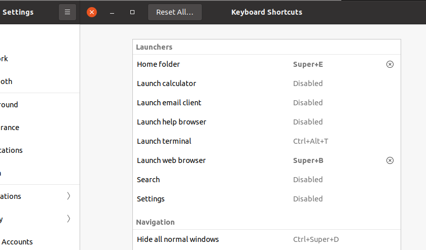

---
aliases:
- /linux/2021/10/21/Just-some-usefull-keyboard-shortcuts
categories:
- linux
date: '2021-10-21'
description: launch Gnome files, firefox
image: images/image_linux.jpg
layout: post
title: Just some usefull keyboard shortcuts
toc: true

---

I cannot believe I have been using linux for more than 20 years as my main system and have never configured keyboard shortcuts to launch explorer files.

